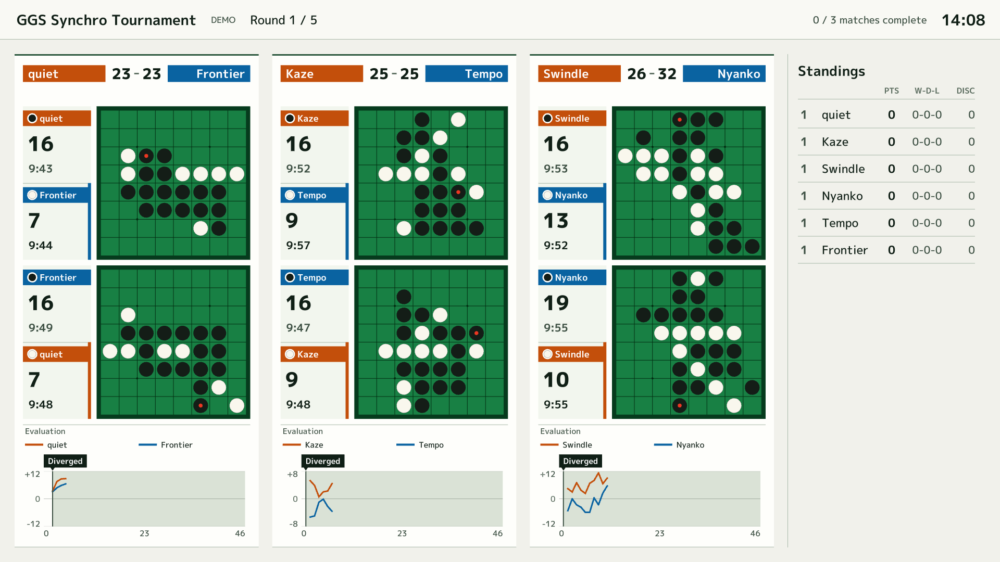
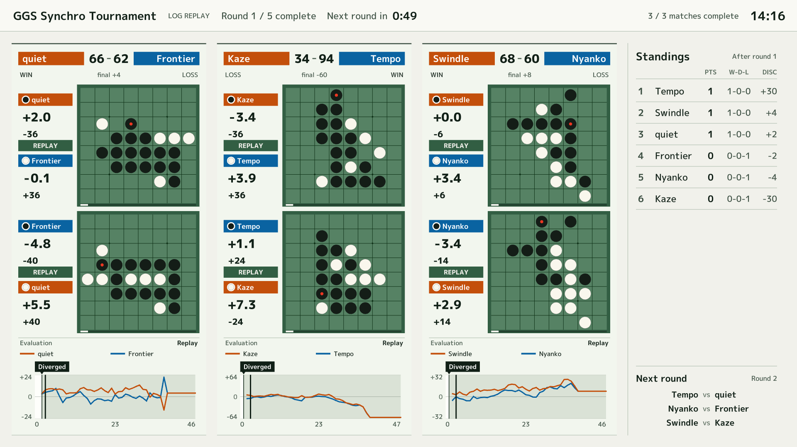
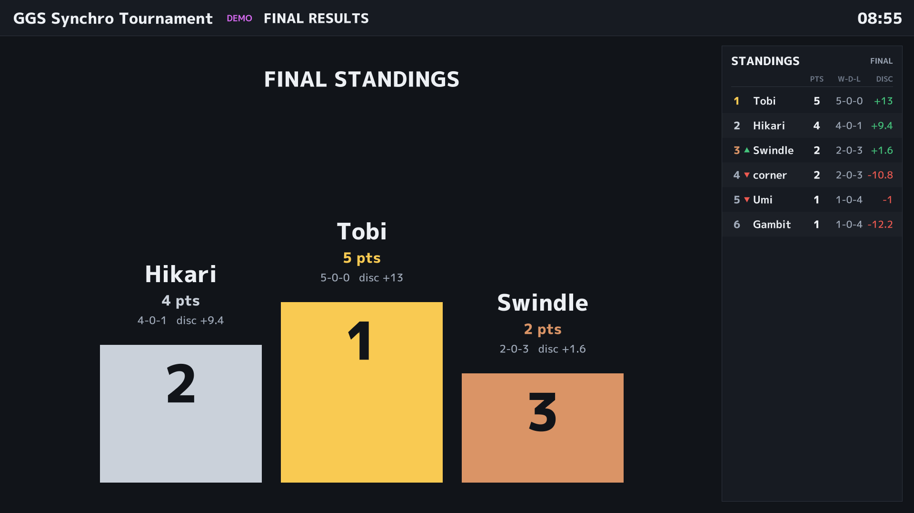
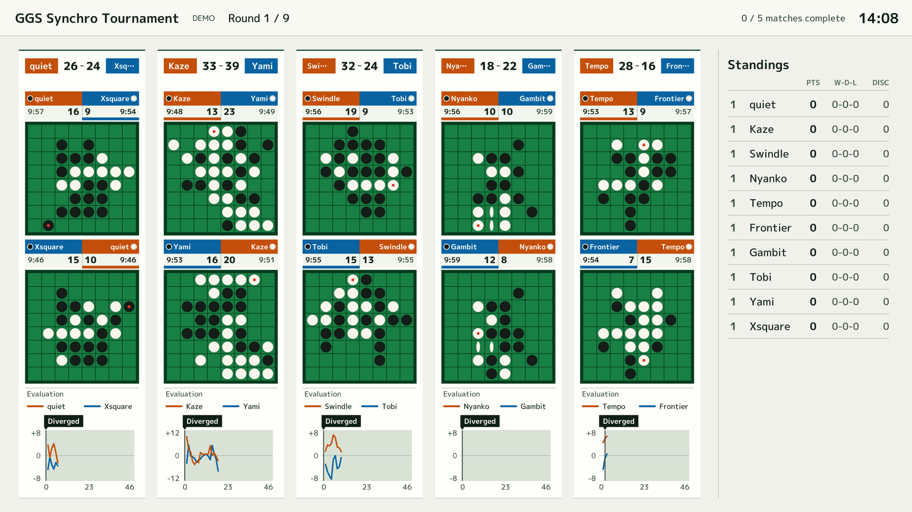

# GGS Stream

GGS (Generic Game Server) で行われるオセロのシンクロ戦トーナメントを配信用に表示するソフトです。Siv3D v0.6.15 で動作します。



※ スクリーンショットは、オフラインのデモ（`--demo`）と、その通信ログの再生で撮影したものです。

## ビルド

- Visual Studio で `GGS_Stream.sln` を開き、Release / x64 でビルドします（環境変数 `SIV3D_0_6_15` が必要）。
- `App/` は `.gitignore` 対象です。Siv3D のプロジェクトテンプレートにある `App/`（`Resource.rc`、`icon.ico`、`engine/`、`dll/`）を置いてください。ビルドすると `App/GGS_Stream.exe` がコピーされます。

## 設定

### `App/info.txt`（必須）

```
GGSのユーザー名
パスワード
トーナメントID
配信タイトル（省略可）
```

### `App/names.txt`（任意）

GGS のログイン名を、画面に出す名前に置き換えます（日本語も可）。1 行に `ログイン名 表示名` を書きます。`#` で始まる行はコメントです。

```
# ログイン名 表示名
egrcd     Egaroucid
foo123    山田（チームA）
```

表示しきれない長い名前は「…」で省略されます。

## 起動オプション

| オプション | 内容 |
| --- | --- |
| `--demo` | GGS に接続せず、内蔵のシミュレータで大会を再現する（動作確認用） |
| `--players N` | デモの参加人数（偶数、既定 6） |
| `--replay LOG` | GGS に接続せず、`App/logs/` に保存された通信ログを再生する |
| `--tournament ID` | トーナメント ID（info.txt より優先。info.txt なしで `--replay` するときに使う） |
| `--speed X` | デモ・ログ再生の速度（既定はデモ 3、ログ再生 1） |
| `--seed N` | デモの乱数シード |
| `--title TEXT` | 配信タイトル（info.txt より優先） |
| `--fullscreen` | フルスクリーンで起動 |
| `--focus N` | N 組目だけを拡大表示した状態で起動 |
| `--sound` | 着手音を ON にして起動 |
| `--capture PREFIX --capture-at 5,30` | 指定秒数にスクリーンショットを `PREFIX_<秒>.png` に保存 |
| `--quit-after SEC` | 指定秒数で終了 |

## キー操作

| キー | 内容 |
| --- | --- |
| `1`〜`9` | その組だけを大きく表示（左上から順に 1, 2, …） |
| `0` | 全組の表示に戻る（大会終了後は結果画面） |
| `Space` | グラフで選択した組のリプレイを停止・再開 |
| `S` | 着手音の ON / OFF（切り替えるとヘッダー右に数秒表示） |
| `F1` | デバッグ表示（接続状態・観戦状況・ログ） |
| `F11` | フルスクリーン切り替え |

誤操作防止のため `Esc` では終了しません。新しいラウンドが始まると拡大表示は解除されます。

画面は 1920x1080 固定で描画し、ウィンドウサイズに合わせて拡大縮小します（OBS のウィンドウキャプチャ向け）。

## 画面の見方

- 参加人数（偶数）に応じて、1 ラウンドの組数分のカードを自動で並べます。盤が最も大きくなるレイアウト（縦・横、プレイヤー情報を盤の横に置くか上に置くか）を自動で選びます。盤が大きいときは座標（a〜h, 1〜8）も表示します。
- カード上部: 2 人の名前と、2 局の石数の合計。左の選手はオレンジ、右の選手は青の名前帯で示し、各盤の名前帯とグラフにも同じ色を使います。組の 2 局が終わると勝敗と合計石差を表示します。
- 各盤: 黒番・白番の名前、石数、持ち時間（手番側のみ減っていきます）。最後に打った石の中央には小さな赤い丸を表示します。手番は選手の色の太いバーで示します。横の情報欄では盤に接する辺、上の情報欄では下辺に表示します。終局すると各局のスコア（石差）を表示します。勝敗は組の 2 局の合計で決まるので、各局には勝ち負けを表示せず、カード上部にだけ表示します。
- 評価値グラフ: 各プレイヤーが 2 局で送ってきた評価値の合計です。横軸は手数で、凡例には評価値を送った選手名を表示します。0 より上は左のプレイヤー優勢、下は右のプレイヤー優勢です。オレンジ線が左のプレイヤー自身の見積もり、青線が右のプレイヤーの見積もり（左視点に反転）です。どちらも実線で表示します。
  - パスした手と、合法手が 1 つしかない局面での手の評価値は使わず、直前の値を引き継ぎます。
  - 終局後はその局の確定石差を使います。
  - 2 局の局面が同じ手数で初めて異なった地点には縦線を引き、グラフ外の `Diverged` からマーカーでその位置を指します。線の右側の背景を変え、分岐前後の領域を区別します。片方が先に着手しただけの場合には表示しません。履歴が不足している場合も、分岐地点を推測して表示することはありません。
- リプレイ: 組の 2 局が両方終わると、少し後から 2 局を並べてリプレイします。盤の色と `REPLAY` の表示で、対局中の盤と区別できます。手数の表示は付けず、グラフの濃い縦線で現在の再生位置を示します。グラフには終局までの全履歴が残ります。分岐点を通過すると、`Diverged` の表示が枠付きから濃い背景に切り替わります。
  - 終了した組のグラフをクリック、または左右にドラッグすると、その位置の局面に移動します。マウスを離しても選んだ局面で停止します。グラフ右上の再生ボタン、または `Space` でそこから再開できます。
- 休憩中: ラウンドが終わると次のラウンドまでのカウントダウンを表示します（トーナメントの設定から取得し、取れなければ 60 秒）。順位表の下に次のラウンドの組み合わせも表示します。
- 右側: 順位表（勝ち点、勝-分-負、平均石差）。ラウンド開始時から順位が上がった人に ▲、下がった人に ▼ を付けます。
- 大会が終わると、全選手の順位・勝ち点・勝敗数・平均石差を画面全体に表示します。優勝者の名前と勝ち点を最も大きく、2・3 位を次に強調し、その他の選手と勝敗数は控えめに表示します。勝ち点が同じ選手の順位を分ける平均石差も強調します。13 人以上では複数列に分け、この画面では右の順位表は表示しません。

ラウンド終了後の休憩中（組ごとのリプレイ、次ラウンドまでのカウントダウン、順位の上下、次ラウンドの組み合わせ）:



大会終了後の結果画面:



10 人大会（5 組）では、プレイヤー情報を盤の上に置くレイアウトになります:



## GGS とのやりとり

- ログイン後に `ms /os`、`ts client -`、`ts vt100 -`、`chann + .tourney`、`chann + /os` を送ります。
- 必要に応じて次のコマンドを送ります。
  - `t /td r <id>`（順位、30 秒ごと。キープアライブを兼ねる）
  - `t /td f <id>`（ラウンド数・休憩時間など）
  - `t /td sr <id> <ラウンド>`（次のラウンドの組み合わせ、ラウンド終了時）
  - `ts match`（対局一覧、全組がそろうまで）
  - `tell /os watch + .<id>`（観戦、盤面が届くまで再送）
- 順位などの表の行は、先頭に `|` が付いていても付いていなくても読み取れます。
- 両プレイヤーがトーナメント参加者であるシンクロ戦だけを表示します。
- 切断されたら自動で再接続し、観戦をやり直します。

## ログと再生

送受信ログは `App/logs/ggs_stream_<日時>.log` に保存されます（パスワードは伏せ字）。本番で表示がおかしかったときは、そのログを `--replay` で再生すると、同じ状況を手元で再現できます。

```
GGS_Stream.exe --replay logs/ggs_stream_20261010-130000.log --speed 10
```

ログ再生中はヘッダーに `LOG REPLAY` と表示されます。

## ソース構成

| ファイル | 内容 |
| --- | --- |
| `Main.cpp` | 設定の読み込み、メインループ、キー操作 |
| `ggs_protocol.hpp` | GGS のメッセージの区切りとパース |
| `ggs_net.hpp` | GGS への接続（専用スレッド、再接続）とデモ用の入力源 |
| `log_replay.hpp` | 通信ログの再生 |
| `stream_model.hpp` | 大会・組・対局の状態管理、評価値の集計、リプレイ |
| `stream_view.hpp` | 描画 |
| `demo_server.hpp` | オフラインのシミュレータ（GGS と同じ書式のテキストを生成） |
| `app_log.hpp` | ログ |
| `board.hpp` ほか | Egaroucid の盤面処理 |

## テスト

`tests/protocol_test.cpp` はパーサ・状態管理・シミュレータ・ログ再生のテストです（Siv3D 不要）。x64 Native Tools Command Prompt で:

```
cd tests
cl /std:c++latest /EHsc /O2 /I.. protocol_test.cpp
protocol_test.exe
```
